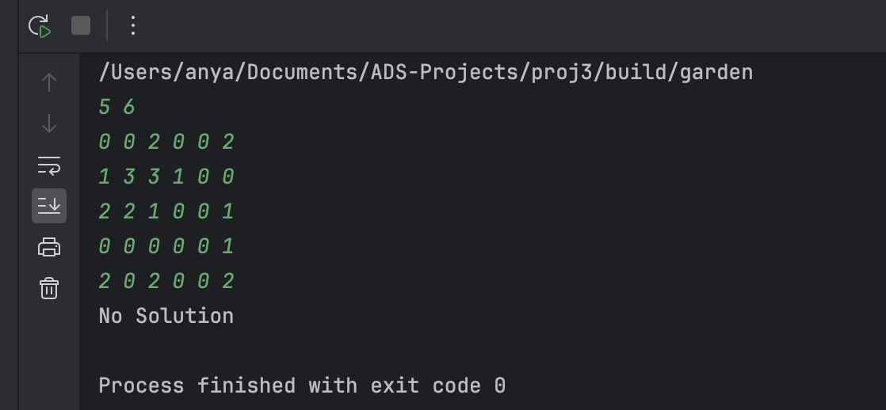
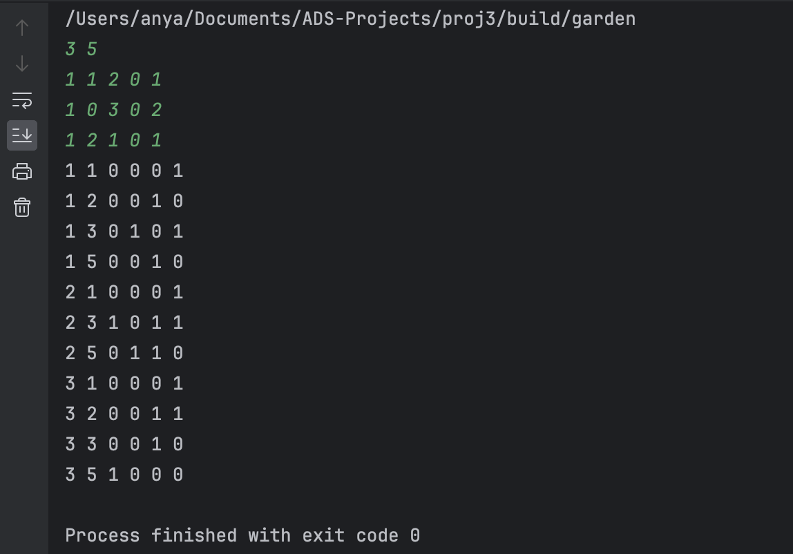

<style>
body, pre {
  font-family: 'Times New Roman', serif;
}
</style>

<style>
    code {
        font-family: 'Georgia', sans-serif;
        font-size: 90%;
    }
</style>


# Recover the Design

## Chapter 1: Introduction

### 1.1 Background

The garden designer drew a diagram of the fence layout, as shown in Figure 1. Here we assume that the garden is an $n\times m$ rectangular space consists of unit squares. All the fences in the diagram are either horizontal or vertical, and are connected together by connectors at certain designated positions. When the workers carried the connectors to the corresponding positions, they found that the design drawing was gone. So now we are facing the situation in Figure 2: several k-way connectors are placed at some positions.</br>
Our job is to **restore the diagram**, that is, to recover Figure 1 from Figure 2.


This program, given the positions of the connectors, will output the positions of the connectors and the directions of the fences. The output should be in the following format: for each connector, output its position and the directions of the fences connected to it. The position is represented by the row and column numbers of the corresponding unit square. The directions of the fences are represented by four integers: 0 means no fence in that direction, 1 means there is a fence in that direction. The four integers represent the directions of up, down, left, and right, respectively. The output should be sorted by the row number of the connectors. If two connectors have the same row number, they should be sorted by the column number. If two connectors have the same row and column numbers, they should be sorted by the directions of the fences connected to them. The output should be in the following format: row column up down left right.

### 1.2 Project Overview

The project can be divided into two parts: **connect the connectors** and **recover the diagram**. In the first part, we need to connect all the connectors to find **all the potential paths**. In the second part, we use **backtrace** to recover the diagram by finding the valid paths in the graph.</br>
We use cpp to implement the project, and the main function is divided into three parts: **create the garden graph**, **find the potential paths**, and **recover the diagram**. We use vector to store the information of the connectors and paths, which is convenient for us to access the information and implemented by cpp standard library. We also use **recursive function** to recover the diagram, which is a typical backtracking algorithm.

## Chapter2: Algorithm Specification

### 2.1 Data Structure and Variables

- `n` and `m` are the number of rows and columns in the garden.
- `garden` is a 2D array to store the garden layout.
- `connectors` is a vector to store all connectors.
- `paths` is a vector to store all paths.
- `degree` is the degree of the current connector.
- `totaldegree` is the total degree of all connectors.
- `Connector` is a struct to store the information of a connector.
- `Site` is a struct to store the position of a site.
- `Path` is a struct to store the information of a path.
- `Garden` is a struct to store the information of a site in the garden.
- `ConnectorNum` is the number of connectors.
- `PathNum` is the number of paths.
- `TotalPathnum` is the total number of paths.
- `solution` is a flag to indicate whether a solution is found.

```cpp
int n, m; // Number of rows and columns in the garden.
vector<vector<Garden> > garden; // 2D array to store the garden layout.
vector<Connector> connectors(3000); // Vector to store all connectors.
vector<Path> paths(3000);
int degree;
int totaldegree = 0;

struct Connector {
    int degree;
    int row;
    int col;
    int up, down, left, right;
};
struct Site {
    int x;
    int y;
};
struct Path {
    int valid;
    Site begin;
    Site end;
};
struct Garden {
    int connector_index;
    int degree;
};

int ConnectorNum = 0;
int PathNum;
int TotalPathnum = 0;
bool solution = false;
```

### 2.2 Function1: Create the garden Graph

This part is simple, we just need to initialize the garden and store the information of the connectors.</br>
We also need to calculate the total degree of all connectors and check whether the total degree is even.

If the total degree is **odd**, then there is **no solution**.

```cpp
function initializeAndPopulateGarden(n, m)
    // Initialize the garden with dimensions (n+1) x (m+1)
    garden = create 2D array of size (n+1) x (m+1)
    totaldegree = 0
    ConnectorNum = 0

    // Populate garden with degree data
    for i from 1 to n
        for j from 1 to m
            degree = read integer input
            garden[i][j].degree = degree
            if degree > 0
                garden[i][j].connector_index = ConnectorNum
                connectors[ConnectorNum].row = i
                connectors[ConnectorNum].col = j
                connectors[ConnectorNum].degree = 0
                ConnectorNum++
                totaldegree += degree

    // Check for odd total degree, implying no solution
    if totaldegree % 2 == 1
        print "No Solution"
        return 0
    else
        PathNum = totaldegree / 2
```

### 2.3 Function2: Find the potential Paths

We find all the potential paths in the garden and store them in the **paths vector**.</br>
We first find the horizontal paths and then find the vertical paths.</br>
We use two loops to **traverse the garden and find the connectors**.

We initialize the pre_degree and pre_pos.</br>
If the pre_degree is 0 and the current degree is not 0, then we initialize the pre_degree and pre_pos.</br>
If the pre_degree is not 0 and the current degree is not 0, then we store the path information in the paths vector. That is, if we **find a connector**, we initialize the pre_degree and pre_pos.</br> 
Then we find the **next connector** and store the path information in the paths vector.

```cpp
function findPaths(garden, n, m)
    initialize paths vector

    // Horizontal paths
    for each row i from 1 to n
        initialize pre_degree and pre_pos
        for each column j from 2 to m
            if no previous connector and current has connector
                set pre_degree and pre_pos
            else if there's a connector continuation
                store path from pre_pos to j
                update pre_pos

    // Vertical paths
    for each column j from 1 to m
        initialize pre_degree and pre_pos
        for each row i from 2 to n
            if no previous connector and current has connector
                set pre_degree and pre_pos
            else if there's a connector continuation
                store path from pre_pos to i
                update pre_pos

```

### 2.4 Function3: Recover the Diagram

This part is the **most important part** of the project.We use a **recursive** function to restore the garden diagram.We use **backtracking** to find the **valid paths** in the garden.</br> 
We also need to check the validity of the fence placement.</br>
If the degree of the connector is greater than the degree of the garden, then the fence placement is invalid.</br>
We also need to check whether the total number of valid paths is equal to the total number of paths.If the total number of valid paths is equal to the total number of paths, then we find a solution.</br>
We use a **flag solution** to indicate whether a solution is found. If a solution is found, we output the diagram.

```cpp
function restoreGarden(PathIndex, ValidPathNum, garden, paths, connectors)
    if PathIndex > TotalPathnum or solution or ValidPathNum > PathNum
        return

    // Check if the current paths fulfill the path requirements
    if ValidPathNum == PathNum
        for each connector i in connectors
            if connectors[i].degree != garden[connectors[i].row][connectors[i].col].degree
                return
        solution = true
        updatePathConnections(paths, connectors, garden)

    // Try to place a valid path or skip it
    Connector1_index = garden[paths[PathIndex].begin.x][paths[PathIndex].begin.y].connector_index
    Connector2_index = garden[paths[PathIndex].end.x][paths[PathIndex].end.y].connector_index

    // Validate the possible path
    if connectors[Connector1_index].degree + 1 <= garden[paths[PathIndex].begin.x][paths[PathIndex].begin.y].degree and
       connectors[Connector2_index].degree + 1 <= garden[paths[PathIndex].end.x][paths[PathIndex].end.y].degree
        paths[PathIndex].valid = 1
        connectors[Connector1_index].degree++
        connectors[Connector2_index].degree++
        restoreGarden(PathIndex + 1, ValidPathNum + 1, garden, paths, connectors)
        connectors[Connector1_index].degree--
        connectors[Connector2_index].degree--

    paths[PathIndex].valid = 0
    restoreGarden(PathIndex + 1, ValidPathNum, garden, paths, connectors)

```

### Function4: Output the Diagram

We output the diagram based on the flag solution. If a solution is found, we output the diagram in the form `row column up down left right`. Otherwise, we output "No Solution".

```cpp
    if (!solution) {
        cout << "No Solution" << endl;
    } else {
        for (int i = 0; i < ConnectorNum; ++i) {
            cout << connectors[i].row << " " << connectors[i].col << " "
                 << connectors[i].up << " " << connectors[i].down << " "
                 << connectors[i].left << " " << connectors[i].right << "\n";
        }
    }
```

## Chapter3: Testing Results

### 3.1 Test Case 1: No Solution

The degree of the connectors is **odd**. There is **no solution**.



```txt
5 6
0 0 2 0 0 2
1 3 3 1 0 0
2 2 1 0 0 1
0 0 0 0 0 1
2 0 2 0 0 2
```

Output:

```txt
No Solution
```     

### 3.2 Test Case 2: Normal Case

Input:

```txt
5 6
0 0 2 0 0 2
1 3 3 1 0 0
2 2 1 0 0 2
0 0 0 0 0 1
2 0 2 0 0 2
```

Output:

```txt
1 3 0 1 0 1
1 6 0 1 1 0
2 1 0 0 0 1
2 2 0 1 1 1
2 3 1 0 1 1
2 4 0 0 1 0
3 1 0 1 0 1
3 2 1 0 1 0
3 3 0 0 0 1
3 6 1 0 1 0
4 6 0 1 0 0
5 1 1 0 0 1
5 3 0 0 1 1
5 6 1 0 1 0
```



Input:

```txt
3 5
1 1 2 0 1
1 0 3 0 2
1 2 1 0 1
```
Output:

```txt
1 1 0 0 0 1
1 2 0 0 1 0
1 3 0 1 0 1
1 5 0 0 1 0
2 1 0 0 0 1
2 3 1 0 1 1
2 5 0 1 1 0
3 1 0 0 0 1
3 2 0 0 1 1
3 3 0 0 1 0
3 5 1 0 0 0
```

## Chapter4: Analysis and Commnets

This function use backtracking algorithms to solve problems, trying different solutions during the recursive process and finally checking if they are effective. 

### Time complexity

1. **The number of recursive calls:**
This algorithm is mainly implemented through the recursive function **restoreGarden**. For each path **PathIndex**, this function has two recursive calls - one when the current path is valid and the other when the current path is invalid. This means that for the **Total Pathnum** paths, the possible combination of recursive calls is exponential, approximately $O (2^{Total PathNum})$.
2. **The complexity of each recursion:**
    - In recursive calls, the main operation performed is to check whether the degree of the connector is equal to the degree of the corresponding position in gardening, which involves traversing all connectors with a complexity of $O(ConnectorNum)$.
    - If the number of valid paths is equal to PathNum, all paths and related connector update operations will be traversed, with a complexity of $O(Total Pathnum)$.

Therefore, the overall time complexity is roughly $O (2^{Total Pathnum}\times (ConnectorNum+Total Pathnum))$. This indicates that the time complexity of the algorithm is very high, especially when the number of paths increases.

### Spatial complexity

1. **Recursive stack**
The maximum recursive depth is **TotalPathnum**, as each path may be processed once in recursion. Therefore, the spatial complexity of the recursive stack is $O(Total Pathnum)$.

2. **Auxiliary space**
The sizes of the connector array **connectors** and path array **paths** are **ConnectorNum** and **TotalPathnum**, respectively.
The two-dimensional array **garden** is based on the size of garden diagram, which is $M \times N$.</br>
Therefore, the overall spatial complexity is $O(Total Pathnum+m \times n+Connector Num)$, and considering the possible values of **Total Pathnum**, **m**, **n** and **Connector Num**, the spatial complexity is mainly influenced by the size of horticulture and the number of paths.

### Comments

1. **Complexity**
    - This algorithm can work well for **small-scale** garden diagrams, but the **time complexity is high**, especially when the number of paths is large. Therefore, it is better to optimize the algorithm to reduce the time complexity, such as reducing the number of recursive calls or improving the efficiency of the recursive function.
2. **Scalability**
    - The algorithm can be applied to **different sizes of garden diagrams**, but the time complexity will increase with the increase of the number of paths.

