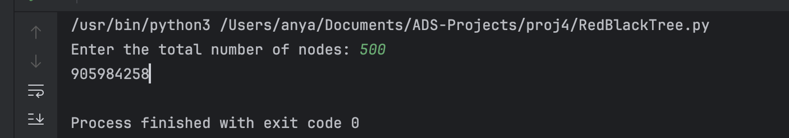

<style>
body, pre {
  font-family: 'Times New Roman', serif;
}
</style>

<style>
    code {
        font-family: 'Georgia', sans-serif;
        font-size: 90%;
    }
</style>

# Red-black Tree

## Chapter1: Introduction

### 1.1 Background

There is a kind of binary tree named red-black tree in the data structure. It has the following 5 properties:

1. Every node is either red or black.
2. The root is black.
3. All the leaves are NULL nodes and are colored black.
4. Each red node must have 2 black descends (maybe NULL).
5. All simple paths from any node x to a descendant leaf have the same number of black nodes.

We call a **non-NULL** node an **internal** node. From property 5 we can define the black-height of a
red-black tree as the number of nodes on the simple path from the root (excluding the root itself)
to any NULL leaf (including the NULL leaf). And we can derive that a red-black tree with black height H has at least $2^H − 1$ internal nodes.

Here comes the question: given a positive $N$, how many distinct red-black trees are there that consist of exactly $N$ internal nodes?

### 1.2 Project Overview

We are going to solve the above question by **dynamic programming**. We will classify the red-black trees by the number of internal nodes and the black height. We will use two **2D arrays** to store the number of trees with a black root and a red root, respectively. We will iterate through all possible black heights and calculate the number of trees with a black root and a red root for each number of internal nodes and black height. Finally, we will sum up the number of trees with a black root at all possible heights to get the final result.

## Chapter2: Algorithm Specification

### 2.1 Data Structure and Variables

We use 2 2D arrays to store the number of trees with a black root and a red root, respectively. We also define some constants for the maximum number of nodes, a large prime for modulo operations, and the maximum height based on the possible maximum black height.

1. **Constants**:
   - `NODES_MAX`: Maximum number of nodes
   - `OVERFLOW`: A large prime for modulo operations to prevent integer overflow
   - `HEIGHT_MAX`: Adjusted maximum height based on possible maximum black height

2. **Global Variables**:
    - `BlackDP`: A 2D array to store the count of trees with a black root, classified by number of nodes and black height. Rows represent the number of nodes, and columns represent the black height, and the value at each cell represents the number of distinct trees with a black root.
    - `RedDP`: A 2D array to store the count of trees with a red root, classified by number of nodes and black height. Rows represent the number of nodes, and columns represent the black height, and the value at each cell represents the number of distinct trees with a red root.

> Though an actual Balck-Red Tree can't have a red root, we still need to consider the case of a red root in the dynamic programming process. This is because the **subtrees of a red root tree can have a black root**, and the black height of the left subtree and right subtree must be the same.


```python
# Constants
NODES_MAX = 505  # Maximum number of nodes
OVERFLOW = 1000000007  # A large prime for modulo operations to prevent integer overflow
HEIGHT_MAX = 30  # Adjusted maximum height based on possible maximum black height

# Global variables for dynamic programming results
BlackDP = [[0] * HEIGHT_MAX for _ in range(NODES_MAX)]  # Count of trees with a black root, classified by number of nodes and black height
RedDP = [[0] * HEIGHT_MAX for _ in range(NODES_MAX)]    # Count of trees with a red root, classified by number of nodes and black height

```

### 2.2 Dynamic Programming

1. initialize base cases for the dynamic programming table
2. iterate through all possible black heights
3. for each number of nodes, calculate the number of trees with a black root and a red root at the current black height
4. calculate the final result by summing up the number of trees with a black root at all possible heights

```python
def main():
    n = int(input("Enter the total number of nodes: "))  # Input total number of nodes

    # Initialize base cases, root node don't count into BH, NIL count into BH
    BlackDP[1][1] = 1  # 1 for node number, 1 for black height, 1 for distinct trees number
    BlackDP[2][1] = 2  # 2 for node number, 1 for black height, 2 for distinct trees number
    RedDP[1][1] = 1    # 1 for node number, 1 for black height, 1 for distinct trees number

    # Dynamic programming to fill the table
    for i in range(3, n + 1):
        for j in range(int(math.log2(i + 1) / 2), int(math.log2(i + 1) * 2) + 1): # Iterate through all possible black heights
            for k in range(1, i - 1):
                # for each Black Root Tree, its subtrees can have 1 black root or 1 red root
                # and the black height of left subtree and right subtree must be the same
                BlackDP[i][j] = (BlackDP[i][j] + (((BlackDP[k][j - 1] + RedDP[k][j])
                                                   * (BlackDP[i - 1 - k][j - 1] + RedDP[i - 1 - k][j])) % OVERFLOW)) % OVERFLOW
                # for each Red Root Tree, its subtrees must have black root
                # and the black height of left subtree and right subtree must be the same
                RedDP[i][j] = (RedDP[i][j] + ((BlackDP[k][j - 1] * BlackDP[i - 1 - k][j - 1]) % OVERFLOW)) % OVERFLOW

    # Calculate the final result for trees with a black root at all possible heights
    totalTrees = 0
    for i in range(HEIGHT_MAX):
        totalTrees = (totalTrees + BlackDP[n][i]) % OVERFLOW

    # Output the final result
    print(totalTrees)
```

## Chapter3: Test cases

### 3.1 Normal Test Cases

Input:

```txt
5
```

Output:

```txt
8
```


### 3.2 Large Test Cases

Input:

```txt
100
```

Output:

```txt
167844408
```


Input:

```txt
500
```

Output:

```txt
905984258
```



## Chapter4: Analysis and Commnets

### 4.1 Time Complexity

The **time complexity** of the dynamic programming solution is $O(N^2 \log N)$, where $N$ is the total number of nodes. The outer loop iterates through all possible numbers of nodes, and the inner loop iterates through all possible black heights. The calculation of the number of trees with a black root and a red root at each black height takes $O(N)$ time. Therefore, the overall time complexity is $O(N^2 \log N)$.

### 4.2 Space Complexity

The **space complexity** of the dynamic programming solution is $O(N \log N)$, where $N$ is the total number of nodes. We use two 2D arrays to store the number of trees with a black root and a red root, respectively. The size of each array is $N \times \log N$. Therefore, the overall space complexity is $O(N \log N)$.

### 4.3 Comments

The dynamic programming solution is an efficient way to solve the problem of counting the number of distinct red-black trees with a given number of internal nodes. By classifying the trees based on the number of nodes and black height, we can calculate the number of trees with a black root and a red root at each black height. The final result is obtained by summing up the number of trees with a black root at all possible heights. The time complexity of the solution is $O(N^2 \log N)$, and the space complexity is $O(N \log N)$.
